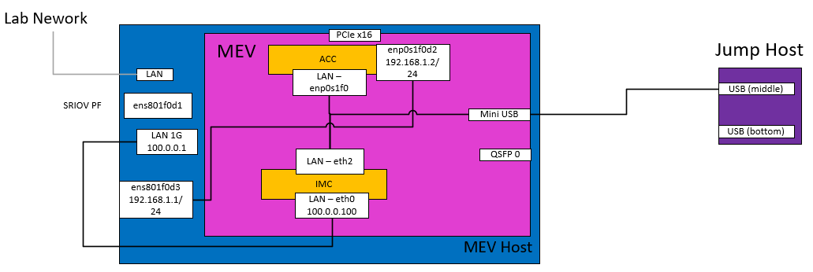

# IPU manager E2E test with K8s
This doc describes the steps for testing the IPU manager with K8s.
It requires a FXP P4 pipeline which is included (pre-compiled) in this repo. 
Please follow the instructions below on how to bring up test environment for Host, IMC and ACC.

## Dependencies and compatibility

```
Host OS: RHEL 9.2
Kernel: 5.14.0-284.11.1.el9_2.x86_64
Golang: go1.20.4 linux/amd64
Kubernetes:
Client Version: v1.28.2
Server Version: v1.28.2
ContainerD: 1.6.24
Calico: v3.26.1
Multus: v4.0.2
SR-IOV Network Device plugin: latest image (ghcr.io/k8snetworkplumbingwg/sriov-network-device-plugin@sha256:1ba7727a95abefb356e756985d813893623d6898b6a4a12be77e9fbc48abdc6e)
SR-IOV CNI with custom patch
```


## Setup Diagram



## MEV IMC & ACC
```
CI BUILD: 6584
P4 recipe: Linux Networking recipe (Deploy P4 Artifacts)
```

## Clone repository 

```bash
git clone https://github.com/intel/ipu-opi-plugins
```

Set path to directory
```
cd ipu-opi-plugins
export ROOT_DIR=$(pwd)
```

## Deploy the P4 Artifacts for ES2K
This section explains how to deploy the P4 program on the hardware Flexible Pipeline (FXP).

Data Path Control Plane (DPCP) starts with a default P4 package. As part of this setup, a custom P4 package will need to be loaded (i.e., linux_networking.pkg) to IMC. To load a custom P4 package proceed with the steps below. This package has been pre-compiled and can be found in `e2e/artefacts/p4`. 

### Deploy
Copy the `linux_networking.pkg` file from HOST to `/work/scripts/` directory on IMC.
The IMC should be accessible through ssh from the HOST at the IP address 100.0.0.100 

Add IMC address to the interface connected to MEV
```bash
ip addr add 100.0.0.1/24 dev eno1
```
**_NOTE:_** interface may need to be configured.  
eno1 may not be correct for your configuration, it could be eno2. 
Depending on which onboard interface is used.

```bash
# scp $ROOT_DIR/e2e/artefacts/p4/linux_networking.s/linux_networking.pkg root@100.0.0.100:/work/scripts/
```

From the HOST machine, ssh into the IMC:
```bash
# ssh root@100.0.0.100
```

Edit the `load_custom_pkg.sh` file to have the content below:
```bash
root@ipu-imc ~# vi /work/scripts/load_custom_pkg.sh
#!/bin/sh
CP_INIT_CFG=/etc/dpcp/cfg/cp_init.cfg
echo "Checking for custom package..."
if [ -e linux_networking.pkg ]; then
    echo "Custom package linux_networking.pkg found. Overriding default package"
    cp  linux_networking.pkg /etc/dpcp/package/
    rm -rf /etc/dpcp/package/default_pkg.pkg
    ln -s /etc/dpcp/package/linux_networking.pkg /etc/dpcp/package/default_pkg.pkg
    sed -i 's/sem_num_pages = 1;/sem_num_pages = 25;/g' $CP_INIT_CFG
    sed -i 's/acc_apf = 4;/acc_apf = 8;/g' $CP_INIT_CFG
    sed -i 's/comm_vports = ((\[5,0\],\[4,0\]));/comm_vports = ((\[5,0\],\[4,0\]),(\[0,3\],\[4,2\]));/g' $CP_INIT_CFG
else
    echo "No custom package found. Continuing with default package"
fi
```

Create file `config.json` in `/work/cfg/` and make sure it has the content below. This should make the IMC run the script to load the custom package.
```bash
root@ipu-imc ~# cat /work/cfg/config.json
{
   "start_init_app" : "true"
}
```

reboot IMC
```bash
root@mev-imc:~# reboot
```

After IMC restarts, check that the custom package has been loaded correctly:
```bash
root@ipu-imc ~# ls -lrt /etc/dpcp/package/
total 2500
-rw-r--r-- 1 root root 1106392 Jan  1 00:00 linux_networking.pkg
lrwxrwxrwx 1 root root      38 Jan  1 00:00 default_pkg.pkg -> /etc/dpcp/package/linux_networking.pkg
drwxr-xr-x 2 root root    4096 Oct  4  2023 runtime_files
-rw-r--r-- 1 root root 1442232 Oct  4  2023 e2100-default-1.0.12.0.pkg
```
**_NOTE:_** the symbolic link from default_pkg.pkg to /etc/dpcp/package/linux_networking.pkg. \
If this symbolic link is missing then likely the following went wrong: \
(1) the script to load the custom package may contain some error, or\
(2) the script to load the custom package was not executed during startup of the IMC.

### Enable Communication
On ACC, we should see something like this:
```bash
[    6.360336] idpf 0000:00:01.0 enp0s1f0d1: renamed from eth1  
[    6.569522] idpf 0000:00:01.0 enp0s1f0d2: renamed from eth2 <-- USED TO COMMUNICATE WITH HOST
[    6.679568] idpf 0000:00:01.0 enp0s1f0d6: renamed from eth6
[    6.909360] idpf 0000:00:01.0 enp0s1f0d4: renamed from eth4
[    7.039378] idpf 0000:00:01.0 enp0s1f0d5: renamed from eth5  
[    7.159385] idpf 0000:00:01.0 enp0s1f0d3: renamed from eth3 
[    7.299356] idpf 0000:00:01.0 enp0s1f0: renamed from eth0   <-- USED TO COMMUNICATE WITH IMC
[    7.459362] idpf 0000:00:01.0 enp0s1f0d7: renamed from eth7
```
On ACC, enp0s1f0 (renamed from eth0) and enp0s1f0d2 (renamed from eth2) can be used to set up the communication with IMC and HOST.

## Build IDPF driver from source

**_NOTE_** Follow this section of the official documentation provided with MEV 1.1 release \
1.5.10.2. Package/Environment Prerequisites to build IDPF

These steps are an aid if there is an issue from the official docs. 
```bash
yum update -y
yum install -y make perl git bubblewrap patch meson autoconf ninja-build python3-pip automake kernel-devel-$(uname -r)
pip3 install meson
cd Intel_IPU_SDK-6854/
git clone https://github.com/coccinelle/coccinelle.git
cd coccinelle/
bash -c "sh <(curl -fsSL https://raw.githubusercontent.com/ocaml/opam/master/shell/install.sh)"
opam install Ocaml
opam init
eval $(opam env --switch=default)
./autogen
./configure
source env.sh
make clean
make
make host
make install
ls -lrt ipu_host/build/opt/idpf/idpf.ko
sudo insmod ipu_host/build/opt/idpf/idpf.ko
```

## Identify Communication Channel Netdev
On IMC run the following command:
```bash
root@mev-imc:/usr/bin# ./cli_client -cq
No IP address specified, defaulting to localhost
...
fn_id: 0x0   host_id: 0x0   is_vf: no  vsi_id: 0x11  vport_id 0x3   is_created: yes  is_enabled: yes mac addr: 00:11:00:03:03:14  <- (HOST, vport 3)
...
fn_id: 0x4   host_id: 0x4   is_vf: no  vsi_id: 0x9   vport_id 0x2   is_created: yes  is_enabled: yes mac addr: 00:09:00:02:03:18  <- (ACC, vport 2)
```
### Get ACC vport MAC address
```bash
root@mev-imc:/usr/bin/# ./cli_client -cq | awk '{if(($2 == 0x4) && ($4 == 0x4) && ($10 == 0x2)) {print $17}}'

#or with quotes if the above returns nothing

root@mev-imc:/usr/bin/# ./cli_client -cq | awk '{if(($2 == "0x4") && ($4 == "0x4") && ($10 == "0x2")) {print $17}}'
```
This should provide ACC vport MAC address `00:09:00:02:03:18`

### Get Host vport MAC address
```bash
root@mev-imc:/usr/bin/# ./cli_client -cq | awk '{if(($2 == 0x0) && ($4 == 0x0) && ($10 == 0x3)) {print $17}}'

#or with quotes if the above returns nothing

root@mev-imc:/usr/bin/# ./cli_client -cq | awk '{if(($2 == "0x0") && ($4 == "0x0") && ($10 == "0x3")) {print $17}}'
```
This should provide Host vport MAC address `00:11:00:03:03:14`

If HOST ports are not seen, reload the idpf driver on HOST using:
```bash
rmmod idpf
modprobe idpf
```

## Enable network connectivity between HOST and ACC
We are assigning the following IP addresses for Host and ACC. Change them accordingly for your host setup.
```bash
Host IP: 192.168.1.1/24
ACC  IP: 192.168.1.2/24
```

<u>**On Host:**</u>

Configure interface: **ens801f0d3** (this name could be different depends on host OS; match the interface name with MAC address returned by cli_client query above) with IP address `192.168.1.1/24`
```bash
nmcli connection add type ethernet ifname ens801f0d3 con-name ens801f0d3 ip4 192.168.1.1/24
nmcli conn reload
nmcli con up ens801f0d3
```
**_NOTE:_** This is not optional, we must pick the PF with mac addr `00:11:00:03:03:14`

Check IP configurations:
```bash
[root@~ home]# ip -br addr
...
ens801f0d3       UP             192.168.1.1/24 fe80::2e89:1bbd:390d:3278/64
...
```

Enable NAT on host to provide internet connectivity to ACC
```bash
#! /bin/bash
 
IPTABLES=/sbin/iptables
# Interface connected to Lab network
WANIF=eno2
# Interface connected to ACC
LANIF=ens801f0d3
 
# enable ip forwarding in the kernel
echo 'Enabling Kernel IP forwarding...'
/bin/echo 1 > /proc/sys/net/ipv4/ip_forward
 
# enable masquerading to allow LAN internet access
echo 'Enabling IP Masquerading and other rules...'
 
$IPTABLES -t nat -A POSTROUTING -o $LANIF -j MASQUERADE
$IPTABLES -A FORWARD -i $LANIF -o $WANIF -m state --state RELATED,ESTABLISHED -j ACCEPT
$IPTABLES -A FORWARD -i $WANIF -o $LANIF -j ACCEPT
 
$IPTABLES -t nat -A POSTROUTING -o $WANIF -j MASQUERADE
$IPTABLES -A FORWARD -i $WANIF -o $LANIF -m state --state RELATED,ESTABLISHED -j ACCEPT
$IPTABLES -A FORWARD -i $LANIF -o $WANIF -j ACCEPT
 
echo 'Done.'
```

**_NOTE:_** run on MEV host \
**_NOTE:_** must be run if MEV host is rebooted

<u>**On ACC:**</u>

```bash
nmcli connection add type ethernet ifname enp0s1f0d2 con-name enp0s1f0d2 ip4 192.168.1.2/24 gw4 address 192.168.1.1
```
**_NOTE:_** this interface must be enp0s1f0d2

Remove default IMC IP address from default gatwway:
```bash
ip route del default via 192.168.0.1 dev enp0s1f0
```

Reload and bring up network connection:
```bash
nmcli conn reload
nmcli con down enp0s1f0d2
nmcli con up enp0s1f0d2
```

Modify DNS servers in `/etc/resolv.conf`
```
Input DNS server IP addresses here, ours are specific to our own network.
```

reload NetworkManager
```bash
systemctl restart NetworkManager
```
**_NOTE:_** if configuring over ssh connection, this might disconnect you. Serial connection can also be used instead. 

### Optional - proxy settings to `/etc/environment` 
**_NOTE:_** Add proxies relevant to your environment

Test internet connectivity
```bash
wget google.com
```

## Start the Infrap4d Process
This section explains how to start the Infrap4d process on Intel IPU E2100.
This section also assumes the steps described in [Deploy the P4 Artifiacts for ES2K](#deploy-the-p4-artifacts-for-es2k) have been performed.

### Extract P4 libraries from tarball
This document assumes that `p4.tar.gz` tarball has been provided by the CI-build. If the tarball does not exist at the location mentioned below, then it may need to be built separately.

### Log in into ACC and untar the p4.tar.gz tarball available under /opt
```bash
root@mev-acc-rl opt~# cd /opt
root@mev-acc-rl opt~# tar -xvf p4.tar.gz
root@mev-acc-rl opt~# cd /opt/p4/
root@mev-acc-rl p4~# ls -lr
...
drwxr-xr-x 2 root root 4096 Nov 17 09:18 p4sde
drwxr-xr-x 2 root root 4096 Nov 17 09:18 p4-cp-nws
```

### Setup the environment
```bash
export SDE_INSTALL=/opt/p4/p4sde
export P4CP_INSTALL=/opt/p4/p4-cp-nws
export DEPEND_INSTALL=$P4CP_INSTALL
export no_proxy=localhost,127.0.0.1,192.168.1.0/16
export NO_PROXY=localhost,127.0.0.1,192.168.1.0/16
```
**_NOTE:_** no_proxy is set to avoid issues with the gRPC server connection

### Generate the forwarding pipeline binary
Create an empty file and rename it to `tofino.bin`:
```bash
export OUTPUT_DIR=/root/linux_networking
cd $OUTPUT_DIR
touch tofino.bin
```
### Copy P4 artifacts from this git repo location to ACC:
Copy files to ACC
```bash
scp -r $ROOT_DIR/e2e/artefacts/p4 root@192.168.1.2:/root/linux_networking
```

These files should be present on ACC
```
linux_networking.bf-rt.json
linux_networking.context.json
linux_networking.p4info.txt
cpt_ver.s
linux_networking.s
```
**_NOTE_** These are the artefacts from the repository. 

```bash
[root@mev-acc-rl linux_networking]# ls -l $OUTPUT_DIR
...
-rw-r--r-- 1 root root    304 Aug 22 02:19 cpt_ver.s
-rw-r--r-- 1 root root  75352 Aug 22 02:19 linux_networking.bf-rt.json
-rw-r--r-- 1 root root 303049 Aug 22 02:19 linux_networking.context.json
-rw-r--r-- 1 root root  24572 Aug 22 02:19 linux_networking.p4info.txt
drwxr-xr-x 2 root root   4096 Aug 22 02:19 linux_networking.s
```

```bash
[root@mev-acc-rl linux_networking]# ls -l linux_networking.s/
...
-rw-r--r-- 1 root root 1106392 Aug 22 02:19 linux_networking.pkg
```
**_NOTE:_** `linux_networking.s` is a folder that has the `linux_networking.pkg` file.

### Prepare the configuration file 
On ACC, handcraft the configuration file `/usr/share/stratum/es2k/es2k_skip_p4.conf` with the following parameters:

- `pcie_bdf`

   Get PCI BDF of LAN Control Physical Function (CPF) device with device ID 1453 on ACC:

   ```bash
   lspci | grep 1453
   00:01.6 Ethernet controller: Intel Corporation Device 1453 (rev 11)
   ```

   The value of `pcie_bdf` should be `00:01.6`

- `iommu_grp_num`

   Get the iommu group number:

   ```bash
   cd $SDE_INSTALL/bin/
   ./vfio_bind.sh 8086:1453
   Device: 0000:00:01.6 Group = 5
   ```
   The value of `iommu_grp_num` in this case is `5` \
   **_NOTE_** This value could be different than `5`

- `vport`

   The number of vports supported is from [0-6].
   For example: `vport=[0-1]`

- `eal_args`

   Support values for `--proc-type` are `primary` and `auto`
   **Note**: In case of multi-process setup which is supported in docker
   environment, `--proc-type` can be used to specify the process type.

- `cfgqs-idx`

   Give options to each process (primary or secondary) to request
   numbers of configure queues. Admin must set cfgqs-idx between `"0-15"`,
   recommended option when running only 1 process. Plan and split config
   queues between multi-processes. For example, to configure two cfgq; use
   `cfgqs-idx: "0-1"`. Supported index numbers are from 0 to 15.

- `program-name`

   Specify the name of P4 program. Set the value for `program-name` to `linux_networking`

- `p4_pipeline_name`

   Specify the name of P4 pipeline. Set the value for `p4_pipeline_name` to `main`

- `bfrt-config`,  `context`, `config` and `path`

   Specify the absolute paths for these files. For example:

   Set the value for `bfrt-config` to
   `/root/linux_networking/linux_networking.bf-rt.json`

   Set the value for `context` to
   `/root/linux_networking/linux_networking.context.json`

   Set the value for `config` to
   `/root/linux_networking/tofino.bin`

   Set the value for `path` to
   `/root/linux_networking`

The final `es2k_skip_p4.conf` will look like:

```json
{
    "chip_list": [
    {
        "id": "asic-0",
        "chip_family": "mev",
        "instance": 0,
        "pcie_bdf": "0000:00:01.6",
        "iommu_grp_num": 5
    }
    ],
    "instance": 0,
    "cfgqs-idx": "0-15",
    "p4_devices": [
    {
        "device-id": 0,
        "fixed_functions" : [],
        "eal-args": "--lcores=1-2 -a 00:01.6,vport=[0-1] -- -i --rxq=1 --txq=1 --hairpinq=1 --hairpin-mode=0x0",
        "p4_programs": [
        {
            "program-name": "linux_networking",
            "bfrt-config": "/root/linux_networking/linux_networking.bf-rt.json",
            "p4_pipelines": [
            {
                "p4_pipeline_name": "main",
                "context": "/root/linux_networking/linux_networking.context.json",
                "config": "/root/linux_networking/tofino.bin",
                "pipe_scope": [
                    0,
                    1,
                    2,
                    3
                ],
                "path": "/root/linux_networking"
            }
            ]
        }
        ],
        "agent0": "lib/libpltfm_mgr.so"
    }
    ]
}
```

#### 3.4 Generate the Binary File

On ACC, use `tdi_pipeline_builder` available under `/opt/p4/p4-cp-nws/bin` to
combine the artifacts generated by the `p4c-pna-xxp` compiler and generate
forwarding pipeline binary.

```bash
$P4CP_INSTALL/bin/tdi_pipeline_builder \
    --p4c_conf_file=/usr/share/stratum/es2k/es2k_skip_p4.conf \
    --bf_pipeline_config_binary_file=/root/linux_networking/linux_networking.pb.bin
```

### Set Huge Pages

On ACC, run the following command:

```bash
mkdir /dev/hugepages
mount -t hugetlbfs -o pagesize=2M none /dev/hugepages
echo 512 > /sys/devices/system/node/node0/hugepages/hugepages-2048kB/nr_hugepages
```

###  Start Infrap4d Process <a name="start_infrap4d_process"></a>

On ACC, run the command below:

```bash
/opt/p4/p4-cp-nws/sbin/infrap4d -grpc_open_insecure_mode=true -nodetach -disable_krnlmon=true
```
 
The following options are used:

- `-grpc_open_insecure_mode=true` is used because the setup described in this document uses an insecure communication mode. 

- `-nodetach` is used to avoid running the `infrap4d` in a detached mode. This is not a strong requirement, but it is useful to see the log generated by the `infrap4d` process. Note that another terminal needs to be used to proceed as the current one will be used by the `infrap4d` process. In case the detached mode is used, double check that the `infrap4d` process has been started and it is running.

- `-disable_krnlmon=true` is used to run the `infrap4d` without krnlmon support. This option can be omitted, but it has been used to make log generated by the binary for setting the P4 rules easily visible. 

See `/opt/p4/p4-cp-nws/sbin/infrap4d --help` for more options.

**Note**: In case that the `infrap4d` fails to start, try to run the start command in the folder where the `linux_networking` recipe files are stored e.g., `cd /root/linux_networking`. Sometimes this command fails and needs to be re-run. 

## Create the Topology <a name="create_topology"></a>


**Note**: `p4rt-ctl` utility used in below steps can be found under `$P4CP_INSTALL/bin`

**Note**:  Section [Set up the environment](#set_up_environment) explains how set the `$P4PC_INSTALL` variable.

### 1. Install Python dependencies

The `p4rt-ctl` binary relies on some Python dependencies that need to be installed before using the `p4rt-ctl` commands.

On ACC, install the following Python dependencies:

```bash
python3 -m pip install --upgrade pip
python3 -m pip install grpcio
python3 -m pip install ovspy
python3 -m pip install protobuf==4.25.0
pip3 install pyelftools
```

**Note**: Do **NOT** set the `PYTHONHOME` or `PYTHONPATH` variables to the Python 3.10 binary and packages provided through the `p4.tar.gz` tarball.

### 2. Set the Forwarding Pipeline

Before `p4rt-ctl` commands are executed, the `infrap4d` needs to be started, which is explained in Section [Start the Infrap4d Process](#start_infrap4d_process).

Once the `infrap4d` is started, set the forwarding pipeline config using P4Runtime Client `p4rt-ctl set-pipe` command.

```bash
$P4CP_INSTALL/bin/p4rt-ctl set-pipe br0 /root/linux_networking/linux_networking.pb.bin /root/linux_networking/linux_networking.p4info.txt
```

###  Configure the VSI Group and Add a netdev <a name="configure_vsi_group"></a>

Use one of the IPDF netdevs on ACC to receive all control packets from overlay VM's by assigning to a VSI group. 

On ACC, run the command below to select an interface.

```bash
[root@mev-acc-rl linux_networking]# ip -br l
...
enp0s1f0         UP     00:00:00:00:03:18 <BROADCAST,MULTICAST,UP,LOWER_UP>
enp0s1f0d1       UP     00:08:00:01:03:18 <BROADCAST,MULTICAST,UP,LOWER_UP>
enp0s1f0d2       UP     00:09:00:02:03:18 <BROADCAST,MULTICAST,UP,LOWER_UP>
enp0s1f0d3       UP     00:0a:00:03:03:18 <BROADCAST,MULTICAST,UP,LOWER_UP>  <-- WE USE THIS
enp0s1f0d4       UP     00:0b:00:04:03:18 <BROADCAST,MULTICAST,UP,LOWER_UP>
enp0s1f0d5       UP     00:0c:00:05:03:18 <BROADCAST,MULTICAST,UP,LOWER_UP>
enp0s1f0d6       UP     00:0d:00:06:03:18 <BROADCAST,MULTICAST,UP,LOWER_UP>
enp0s1f0d7       UP     00:0e:00:07:03:18 <BROADCAST,MULTICAST,UP,LOWER_UP>
...
```
Warning: Do not reuse same interface used for ACC and HOST communication

In this document, the `enp0s1f0d3` is selected (the dots are added to show that other network interfaces may already be available).

Note that `enp0s1f0d3` has the following MAC address: `00:0a:00:03:03:18`

The second byte in the MAC address is `0a`. 

On IMC, run the command below:

```bash
root@mev-imc:# cd /usr/bin
root@mev-imc:/usr/bin# ./cli_client -cq
...
fn_id: 0x4   host_id: 0x4   is_vf: no  vsi_id: 0xa   vport_id 0x3   is_created: yes  is_enabled: yes mac addr: 00:0a:00:03:03:18
...
```

Note that the VSI `a` is associated with `enp0s1f0d3` network interface.

VSI group 3 is dedicated for this configuration, execute below devmem commands on IMC. 


```bash
# SEM_DIRECT_MAP_PGEN_CTRL: LSB 11-bit is for vsi which need to map into vsig 
devmem 0x20292002a0 64 0x800005000000000a

# SEM_DIRECT_MAP_PGEN_DATA_VSI_GROUP : This will set vsi (set in SEM_DIRECT_MAP_PGEN_CTRL register LSB) into VSIG-3
devmem 0x2029200388 64 0x3

# SEM_DIRECT_MAP_PGEN_CTRL: LSB 11-bit is for vsi which need to map into vsig
devmem 0x20292002a0 64 0xA00005000000000a
```

**Note**: That register value `0x800005000000000a` is given by the VSI number. In this document the VSI was `a`, but if the VSI was `8` then the register value would become `0x8000050000000008`. This needs to be adjusted according to the available network interfaces.

**Note**: Here VSI `a` has been used for receiving all control packets and added to VSI group 3. This refers to HOST netdev VSIG 3 as per the topology diagram. 

# Create MEV SR-IOV virtual functions on Host

```bash
modprobe idpf
## Wait few seconds for kernel module to be initialized

# Create Virtual functions
echo 8 > /sys/class/net/ens801f0/device/sriov_numvfs
```

Check that VFs are created and show up in the host:
 
```bash
ip -br link 

lo               UNKNOWN        00:00:00:00:00:00 <LOOPBACK,UP,LOWER_UP> 
ens786f0         DOWN           3c:fd:fe:df:0d:b8 <NO-CARRIER,BROADCAST,MULTICAST,UP> 
ens786f1         DOWN           3c:fd:fe:df:0d:b9 <NO-CARRIER,BROADCAST,MULTICAST,UP> 
eno1             UP             a4:bf:01:6f:96:20 <BROADCAST,MULTICAST,UP,LOWER_UP> 
eno2             UP             a4:bf:01:6f:96:21 <BROADCAST,MULTICAST,UP,LOWER_UP> 
ens801f0         UP             00:01:00:00:04:73 <BROADCAST,MULTICAST,UP,LOWER_UP> 
ens801f0d1       UP             00:0f:00:01:04:73 <BROADCAST,MULTICAST,UP,LOWER_UP> 
ens801f0d2       UP             00:10:00:02:04:73 <BROADCAST,MULTICAST,UP,LOWER_UP> 
ens801f0d3       UP             00:11:00:03:04:73 <BROADCAST,MULTICAST,UP,LOWER_UP> 
ens801f0v0       UP             00:12:00:00:04:73 <BROADCAST,MULTICAST,UP,LOWER_UP> 
ens801f0v1       UP             00:13:00:00:04:73 <BROADCAST,MULTICAST,UP,LOWER_UP> 
ens801f0v2       UP             00:14:00:00:04:73 <BROADCAST,MULTICAST,UP,LOWER_UP> 
ens801f0v3       UP             00:15:00:00:04:73 <BROADCAST,MULTICAST,UP,LOWER_UP> 
ens801f0v4       UP             00:16:00:00:04:73 <BROADCAST,MULTICAST,UP,LOWER_UP> 
ens801f0v5       UP             00:17:00:00:04:73 <BROADCAST,MULTICAST,UP,LOWER_UP> 
ens801f0v6       UP             00:18:00:00:04:73 <BROADCAST,MULTICAST,UP,LOWER_UP> 
ens801f0v7       UP             00:19:00:00:04:73 <BROADCAST,MULTICAST,UP,LOWER_UP> 
```


## Deploy a single node cluster on Host
Deploy a single node cluster with Multus as delegate plugin and Calico as primary network.

### Initialize K8s cluster
Before proceeding with the next commands, make sure the Kubernetes cluster and container runtime required for a Kubernetes cluster are setup and configured correctly.

```bash
kubeadm init --pod-network-cidr=172.20.0.0/16
mkdir -p $HOME/.kube
cp -i /etc/kubernetes/admin.conf $HOME/.kube/config
chown $(id -u):$(id -g) $HOME/.kube/config

```
### Install Calico
```bash
kubectl create -f https://raw.githubusercontent.com/projectcalico/calico/v3.26.1/manifests/tigera-operator.yaml
```

#### Remove taints so that Pod can be scheduled on Control Plane node in this Single Node Cluster
```bash
kubectl taint nodes --all node-role.kubernetes.io/control-plane-
kubectl taint nodes --all node-role.kubernetes.io/master-
```

Download the Calico config CRD to modify the default cluster IP.
```bash
wget https://raw.githubusercontent.com/projectcalico/calico/v3.26.1/manifests/custom-resources.yaml

```

Edit this file and change the Pod cidr: 172.20.0.0/16
```bash
vi custom-resources.yaml
# This section includes base Calico installation configuration.
# For more information, see: https://projectcalico.docs.tigera.io/master/reference/installation/api#operator.tigera.io/v1.Installation
apiVersion: operator.tigera.io/v1
kind: Installation
metadata:
  name: default
spec:
  # Configures Calico networking.
  calicoNetwork:
    # Note: The ipPools section cannot be modified post-install.
    ipPools:
    - blockSize: 26
      cidr: 172.20.0.0/16
      encapsulation: VXLANCrossSubnet
      natOutgoing: Enabled
      nodeSelector: all()
```

Apply these changes:

```bash
kubectl create -f ./custom-resources.yaml
```

After a while all Calico components should be up and running and `kubectl get nodes` should show the node in **READY** state.


### Install Multus

```bash
kubectl apply -f https://raw.githubusercontent.com/k8snetworkplumbingwg/multus-cni/master/deployments/multus-daemonset.yml
```
### Install modified SR-IOV CNI plugin
We will need to build patched SR-IOV CNI from source. This will require that you have Golang installed on the host to be able to build it.

```bash
cd $ROOT_DIR/sriov_cni
make clean
make deps-update
make
cp build/sriov /opt/cni/bin/
```
**_NOTE_** sriov_cni is a dir inside the joint repository

### Install SR-IOV Network Device Plugin
```bash
kubectl create -f  $ROOT_DIR/e2e/artefacts/k8s/sriov-dp-configMap.yaml

kubectl create -f https://raw.githubusercontent.com/k8snetworkplumbingwg/sriov-network-device-plugin/master/deployments/sriovdp-daemonset.yaml
```

Once the SR-IOV device plugin Pod is in **READY** state the we should see that the MEV virtual functions are listed as extended node resource.

```bash
kubectl get node silpixa00400473 -o json | jq '.status.allocatable'

kubectl get node $NODE -o json | jq '.status.allocatable'
{
  "cpu": "72",
  "ephemeral-storage": "181599731412",
  "hugepages-1Gi": "0",
  "hugepages-2Mi": "0",
  "intel.com/intel_sriov_netdevice": "8",
  "memory": "196617652Ki",
  "pods": "110"
}
```

Create SR-IOV network attachment definition:
```bash
kubectl create -f $ROOT_DIR/e2e/artefacts/k8s/sriov-crd.yaml
```

## Start Infrap4d on ACC
Start Infrap4d on ACC
```bash
/opt/p4/p4-cp-nws/sbin/infrap4d -grpc_open_insecure_mode=true -nodetach -disable_krnlmon=true
```

## Start IPU Manager on ACC

On the host, build the IPU Manager as an arm64 binary and the copy the binary over to ACC.

```bash
cd $ROOT_DIR/ipu-plugin
make
scp bin/linux-arm64/ipuplugin 192.168.1.2:/root/
```

Run IPU Manager on ACC:
```bash
 /root/ipuplugin --bridgeType=linux --interface=enp0s1f0d3 --p4cpInstall="/opt/p4/p4-cp-nws" 
```
**_NOTE_** Must be from from ACC not Host

## E2E Tests
Create Pod 1:
```bash
kubectl create -f $ROOT_DIR/e2e/artefacts/k8s/pod-tc1.yaml
```

Wait until Pod 1 is "running" state and then create Pod 2:
```bash
kubectl create -f $ROOT_DIR/e2e/artefacts/k8s/pod-tc2.yaml
```

Once both Pods are in running state we can do ping and other tests to verify the Pod connectivity over VFs from MEV.
